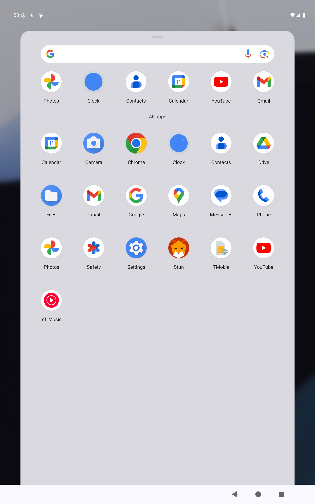
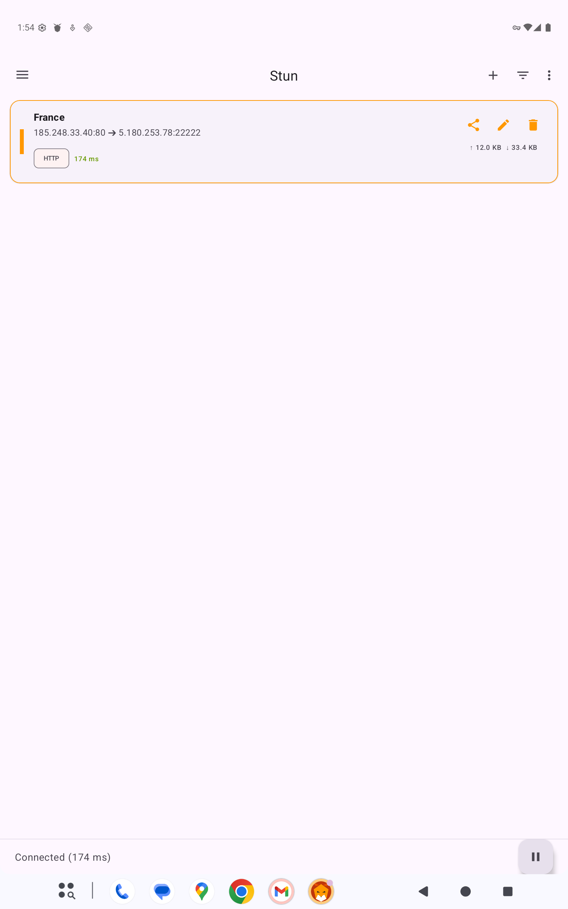
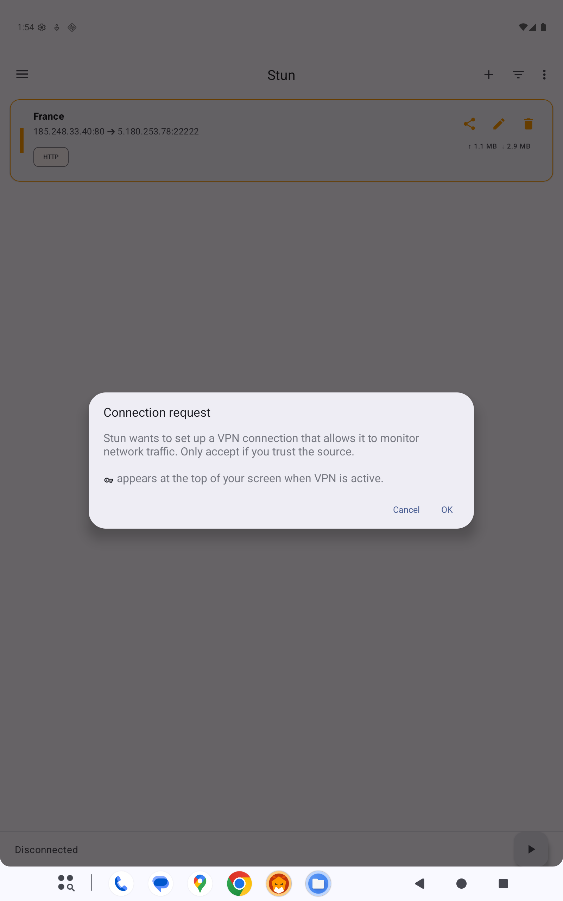
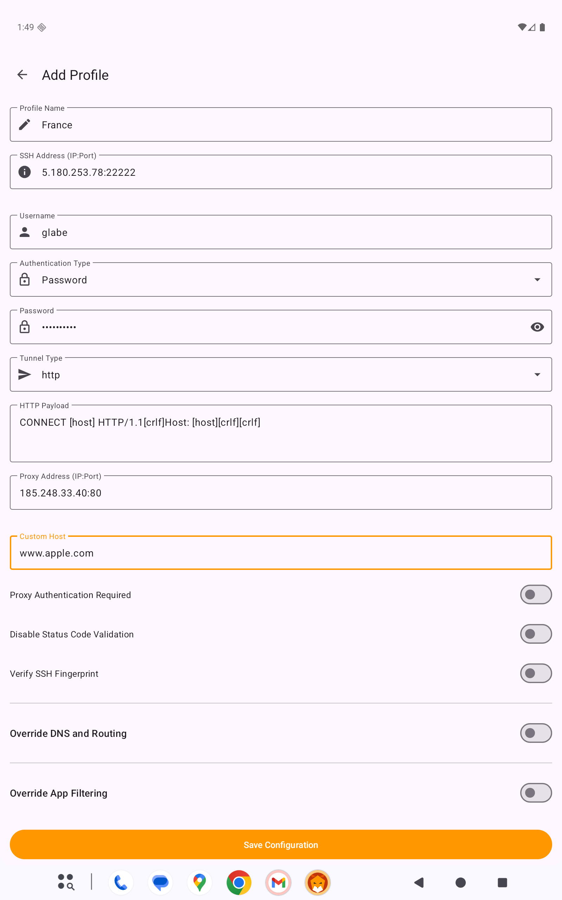
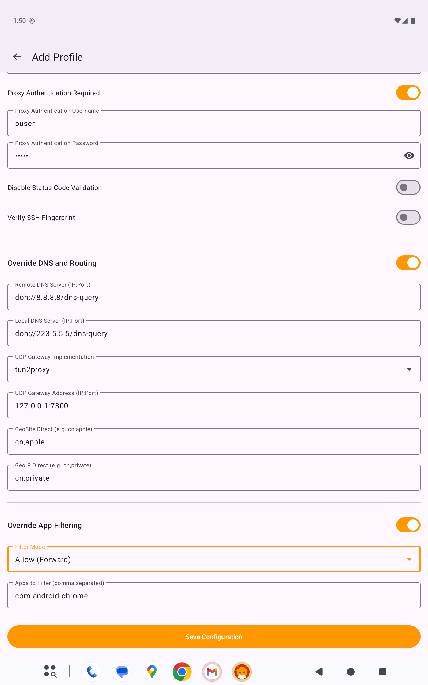
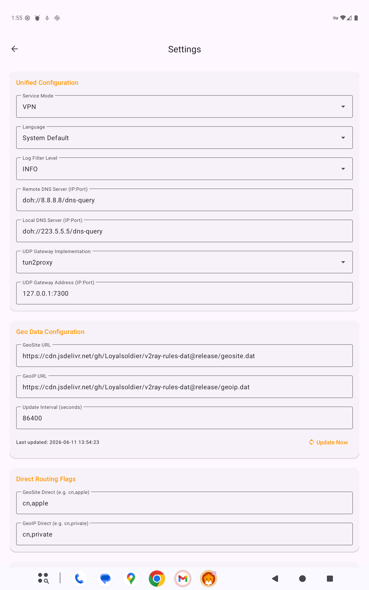
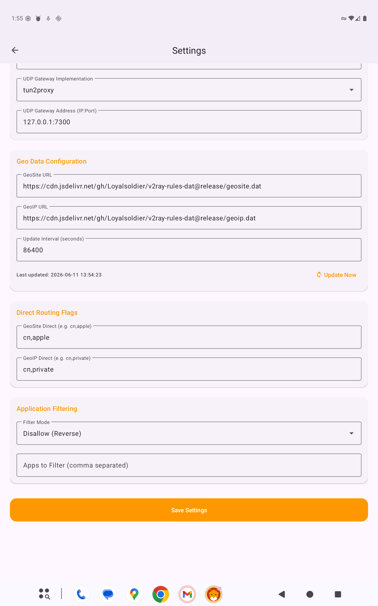
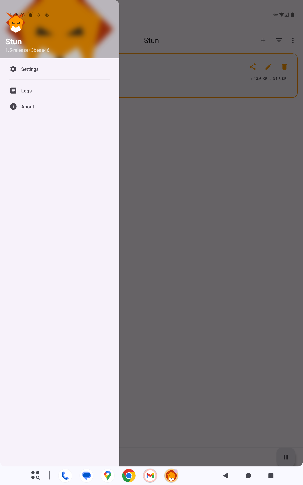
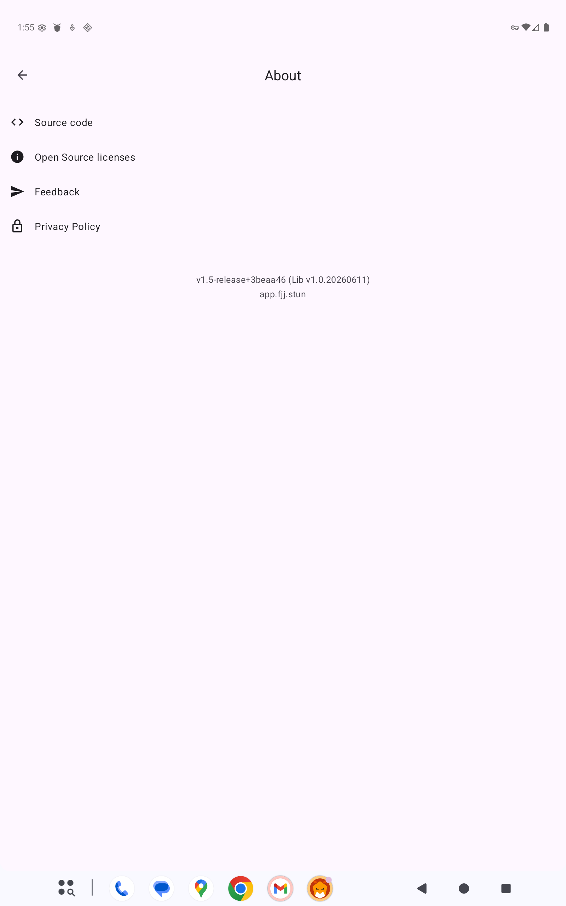

# Stun

<div style="text-align: center;">
  
</div>

Stun is a powerful and lightweight Android proxy client designed for efficiency and ease of use. It leverages TProxy and SSH technologies to provide a secure and flexible networking experience, complete with modern Material 3 design and Android 15 support.

## 📸 Screenshots

<div style="text-align: center;">
  
  
  
</div>
<div style="text-align: center;">
  
  
  
</div>
<div style="text-align: center;">
  
  
  
</div>

## Installation

You can download and install **Stun** using either of the following methods:

### Method 1: Google Play Testing (Recommended)
Join our testing program to install the app and receive automatic updates directly through the Google Play Store. You can opt into the test using either link below:

* **Join on Web:** 👉 [Opt-in via your web browser](https://play.google.com/apps/testing/app.fjj.stun)
* **Join on Android:** 👉 [Open directly in Google Play App](https://play.google.com/store/apps/details?id=app.fjj.stun)

*(Note: Once you opt-in via the web link, you can use the Android link to download it directly to your device.)*

### Method 2: GitHub Releases
If you prefer not to use Google Play, you can download the latest compiled APK directly from our repository.

* 👉 [Download from GitHub Releases](https://github.com/NNdroid/Stun/releases)

*(Note: You may need to enable "Install from Unknown Sources" in your Android device settings to install the downloaded APK.)*

## 🚀 Features

- **TProxy Support:** Seamlessly intercept and proxy system-wide traffic.
- **SSH Tunneling:** Integrated SSH support via `myssh` for secure connections.
- **GeoData Routing:** Advanced routing using Geosite and GeoIP data to distinguish between direct and proxied traffic.
- **Per-App Proxy:** Fine-grained control over which applications use the proxy.
- **Modern UI:** Built with Material 3 components, featuring full Edge-to-Edge support for Android 15.
- **QR Code Integration:** Easily import or share configurations via QR codes.
- **Multilingual:** Supports English, Chinese (Simplified/Traditional), French, and Japanese.
- **Dark Mode:** Fully compatible with system-wide dark and light themes.

## 🌐 Supported Protocols & Server Implementations

Stun supports a wide range of underlying transport protocols to bypass network restrictions and optimize performance. You can use the following open-source server implementations:

| Protocol / Tunnel | Description | Server Implementation |
| :--- | :--- | :--- |
| **`UDP_CUSTOM`** | Lightweight, reliable ARQ UDP stream tunnel with connection migration and PSK auth | 🔗 [**NNdroid/udp_custom**](https://github.com/NNdroid/udp_custom) |
| **`H2` / `H2C`** | Multiplexed HTTP/2 tunnel with AWS TLS masquerading and multi-token auth | 🔗 [**NNdroid/h2tunnel**](https://github.com/NNdroid/h2tunnel) |
| **`XHTTP` / `XHTTPC`** | Modern Chunked / Split HTTP streaming tunnel for CDN and WAF compatibility | 🔗 [**NNdroid/xhttptunnel**](https://github.com/NNdroid/xhttptunnel) |
| **`KCP`** | High-performance ARQ reliable UDP with Reed-Solomon FEC forward error correction | 🔗 [**xtaci/kcptun**](https://github.com/xtaci/kcptun) |
| **`DNS`** | Tunnel SSH traffic through DNS queries (Raw UDP, DoH, DoT) for restricted captive portals | 🔗 [**dnstt**](https://www.bamsoftware.com/software/dnstt/) / [**iodine**](https://github.com/yarrick/iodine) |
| **`WSS` / `WS`** | WebSocket stream tunnel with CDN & reverse proxy support (Cloudflare, Nginx, Caddy) | 🔗 [**erebe/wstunnel**](https://github.com/erebe/wstunnel) / [**Nginx**](https://nginx.org) |
| **`TLS` / `HTTP`** | Standard HTTP CONNECT & TLS SNI proxy | 🔗 [**Squid**](http://www.squid-cache.org/) / [**HAProxy**](https://www.haproxy.org/) |
| **`QUIC` / `H3` / `WT`** | Next-generation QUIC, HTTP/3, and WebTransport low-latency datagram tunnels | 🔗 [**dushixiang/quic-tun**](https://github.com/dushixiang/quic-tun) / [**ginuerzh/gost**](https://github.com/ginuerzh/gost) |
| **`GRPC` / `GRPCC`** | High-concurrency gRPC bidirectional streaming tunnel | 🔗 [**ginuerzh/gost**](https://github.com/ginuerzh/gost) / [**caddyserver/caddy**](https://github.com/caddyserver/caddy) |
| **`MASQUE`** | RFC 9298 IP / UDP Proxying over HTTP/3 (QUIC) | 🔗 [**cloudflare/masque-go**](https://github.com/cloudflare/masque-go) / [**h2o/h2o**](https://github.com/h2o/h2o) |
| **`BASE (Direct)`** | Direct TCP SSH connection | 🔗 [**OpenSSH**](https://www.openssh.com/) |

## 🛠 Tech Stack

- **Language:** 100% Kotlin
- **Build System:** Gradle (Kotlin DSL)
- **Database:** Room for profile management
- **Background Tasks:** WorkManager for GeoData updates
- **Native:** JNI/NDK for high-performance core logic
- **UI:** ViewBinding, Material 3, and ConstraintLayout

## 📦 Building from Source

### Prerequisites
- Android Studio Ladybug (or newer)
- Android SDK 36
- Android NDK (defined in your local.properties or project structure)
- JDK 17

### Steps
1. Clone the repository:
   ```bash
   git clone https://github.com/NNdroid/Stun.git
   ```
2. Open the project in Android Studio.
3. Sync Gradle and build the project.
4. Run the `app` module on your device or emulator.

## ⚙️ Configuration

- **Remote DNS:** Support for DoH (DNS over HTTPS).
- **UDP Gateway:** Configurable UDPGW address for handling UDP traffic over SSH.
- **Routing Rules:** Custom tags for bypassing specific regions or domains (e.g., `cn`, `apple`, `private`).

## 🤝 Contributing

Contributions are welcome! If you have suggestions for improvements or want to report a bug, please open an issue or submit a pull request.

1. Fork the Project
2. Create your Feature Branch (`git checkout -b feature/AmazingFeature`)
3. Commit your Changes (`git commit -m 'Add some AmazingFeature'`)
4. Push to the Branch (`git push origin feature/AmazingFeature`)
5. Open a Pull Request

## 📝 License

Distributed under the [MIT License](LICENSE.txt). See `LICENSE.txt` for more information.

## 📬 Feedback

For bug reports or feature requests, please use the [GitHub Issues](https://github.com/NNdroid/Stun/issues/new) page.

---
*Developed with ❤️ by the Stun Team.*
